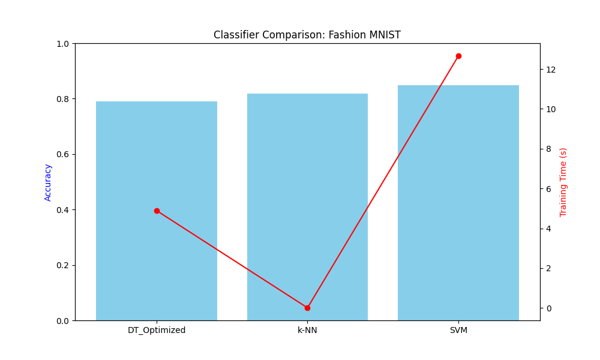

# Decision Tree Optimization & Classification Benchmarks

This module focuses on the implementation and optimization of Decision Trees, followed by a comparative performance analysis against k-NN and SVM models using the **Fashion MNIST** dataset.

## 🛠 Key Implementations
- **Gini Impurity Analysis:** Manual implementation of split-point evaluation to understand tree growth heuristics.
- **Hyperparameter Tuning:** Utilizing `RandomizedSearchCV` to optimize tree depth and splitting criteria.
- **Cross-Algorithm Benchmarking:** Evaluating Decision Trees, k-Nearest Neighbors, and Support Vector Machines on high-dimensional image data.

## 📈 Performance Comparison
The models were evaluated based on **Accuracy** and **Computational Efficiency (Inference Time)**. 

### Benchmark Highlights:
*   **Decision Trees:** Provided the fastest training times but were susceptible to variance.
*   **SVM (Poly Kernel):** Achieved high accuracy on image patterns but required significantly more computational resources.
*   **k-NN:** Demonstrated robust baseline performance with no explicit training phase.

## Dataset
This project utilizes the **Fashion MNIST** dataset (70,000 grayscale images of 10 clothing categories), serving as a complex alternative to the classic MNIST digits.
