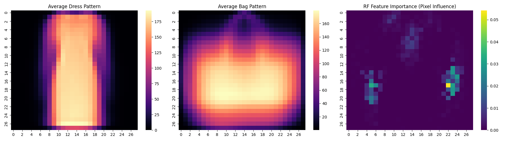

# Ensemble Learning: Boosting theory & Random Forest Interpretability

This module provides a dual-focus study on Ensemble Learning: a mathematical derivation of **AdaBoostM1** as a forward-stagewise additive model and a practical implementation of **Random Forests** for image classification.

## 🧪 Theoretical Foundation: AdaBoost
- **Forward Stagewise Modeling:** Proof that AdaBoost minimizes exponential loss by iteratively weighting misclassified instances.
- **Weight Update Logic:** Detailed analysis of how the $\alpha$ parameter (classifier contribution) is derived from the error rate.

## 🛠 Practical Implementation: Random Forests
- **Binary Classification:** Distinguishing between 'Dresses' and 'Bags' in the Fashion MNIST dataset.
- **Model Interpretability:** Utilizing `feature_importances_` to visualize which pixels (features) the forest prioritizes to distinguish shapes.
- **Dimensionality Reduction:** Filtering datasets using masks to focus on specific high-variance class relationships.

## 📊 Visualizing Decisions
The heatmap below shows the "Average Dress" vs "Average Bag" and the corresponding Feature Importance map. Bright spots in the importance map indicate pixels that the Random Forest uses most heavily to make its classification.

