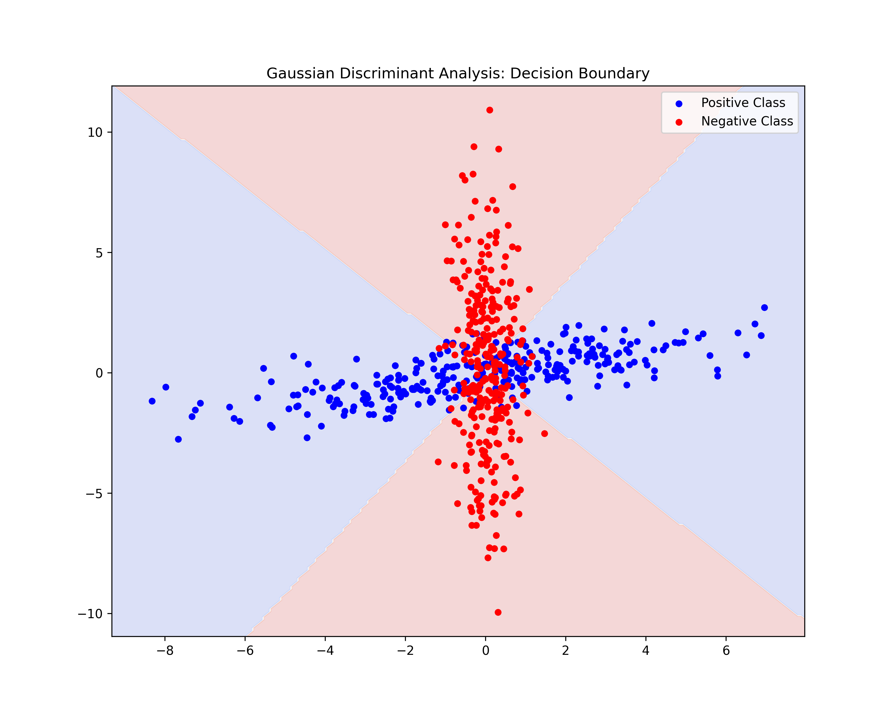

# Gaussian Discriminant Analysis (GDA)

This module implements a Quadratic Gaussian Classifier from scratch to perform binary classification on stochastic data.

## Features
- **Parameter Estimation:** Maximum Likelihood Estimation (MLE) of class-specific means and covariance matrices.
- **Decision Boundary:** Derivation of the quadratic decision surface based on the log-posterior ratio.
- **Visualization:** Mapping the decision territory using contour plotting.

## Mathematical Theory
The classifier assumes each class follows a Multivariate Normal Distribution. The decision boundary is defined where the probability of both classes is equal, resulting in a quadratic form: $x^T A x + b^T x + c = 0$.

