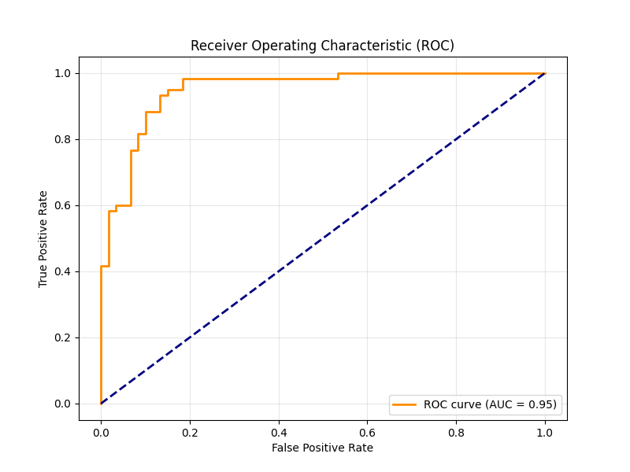

# Logistic Regression: Implementation from Scratch

This module features a complete implementation of binary Logistic Regression using only **NumPy**. It focuses on the optimization process and probabilistic evaluation of classifiers.

## 🛠 Key Implementations
- **Binary Cross-Entropy (BCE) Loss:** Coded from the ground up to evaluate model error.
- **Analytical Gradient Calculation:** Manual derivation and implementation of the gradient of the sigmoid activation function.
- **Gradient Descent Optimization:** An iterative solver that includes custom stopping criteria and convergence monitoring.
- **Bias Intercept Handling:** Feature engineering to include a constant term for the intercept weight.

## 📈 Performance & Evaluation
The model is evaluated using the **Receiver Operating Characteristic (ROC)** curve and the **Area Under the Curve (AUC)** metric. These provide a robust measure of the classifier's ability to distinguish between classes regardless of the chosen threshold.

### ROC/AUC Results
The plot below illustrates the tradeoff between Sensitivity (True Positive Rate) and Specificity (False Positive Rate).



## How to Run
Ensure you have the `DataSet_LR_a.csv` in the module directory, then run:
```bash
python logistic_regression_analysis.py
