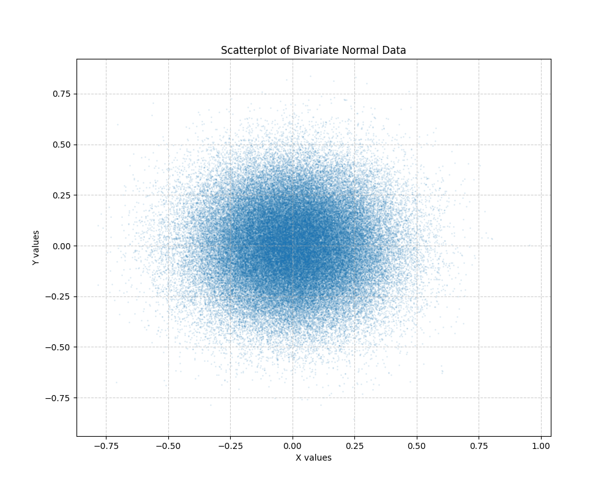

# Mathematical Foundations: Bivariate Normal Distribution

This project demonstrates the generation and visualization of stochastic data using Python's scientific stack (NumPy and Matplotlib).

## Key Features
- **Large-scale Data Generation:** Efficiently generating 100,000+ points using NumPy's vectorized operations.
- **Memory Optimization:** Utilizing `float32` precision for efficient memory handling.
- **Statistical Visualization:** Using alpha-blending to visualize the density of a bivariate distribution.

## Concepts Covered
- Normal (Gaussian) Distributions
- Standard Deviation and Mean in two-dimensional space
- Data type precision in Machine Learning datasets

## Visualization Output

