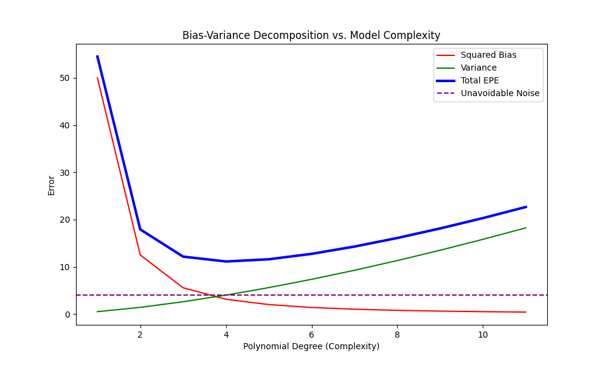

# Model Evaluation & Bias-Variance Analysis

This project explores the fundamental limits of Machine Learning models through error decomposition and performance metrics.

## Key Concepts
- **Bias-Variance Tradeoff:** Visualization of how model complexity (Polynomial Degree) affects generalization.
- **Error Decomposition:** Breaking down Expected Prediction Error (EPE) into Squared Bias, Variance, and Irreducible Noise.
- **Evaluation Metrics:** Implementation of Confusion Matrix components: Precision, Recall, and F1-Score.

## Simulation Output
The plot below demonstrates how increasing model complexity reduces bias but increases variance, leading to a "U-shaped" total error curve.

