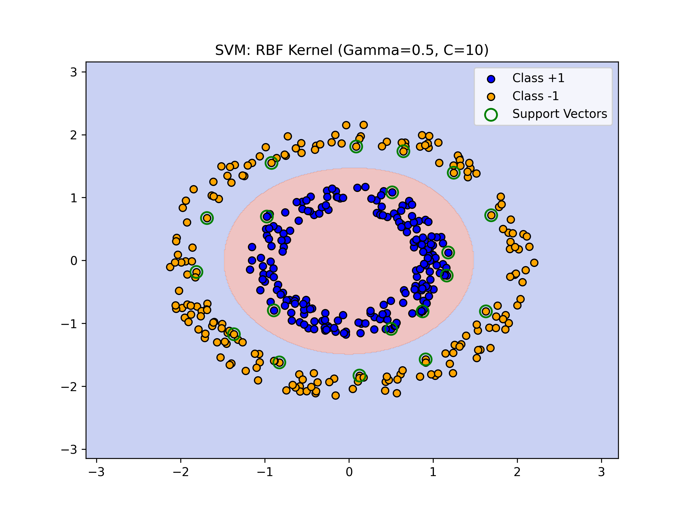
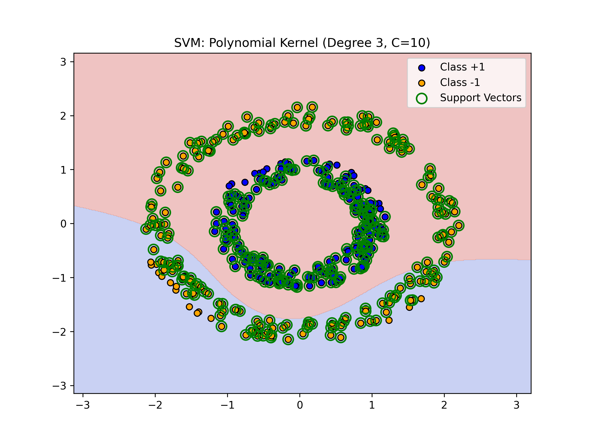

# SVM: Kernel Analysis & Constrained Optimization

This project explores the mathematical and practical implementation of Support Vector Machines (SVMs). It covers the transition from primal optimization problems to dual forms using KKT conditions.

## 🧠 Theory Overview
- **Constrained Optimization:** Utilizing the Lagrangian and Karush-Kuhn-Tucker (KKT) conditions to solve for optimal hyperplanes.
- **Dual Problem Formulation:** Deriving the dual function to enable the "Kernel Trick" for non-linearly separable data.
- **Kernel Comparison:** Evaluating Polynomial vs. Radial Basis Function (RBF) kernels.

## 🛠 Key Features
- **Hyperparameter Tuning:** Analyzing the impact of Cost ($C$) and Gamma ($\gamma$) on the margin width.
- **Boundary Visualization:** Mapping non-linear decision territories and identifying support vectors.
- **Robustness Testing:** Investigating model sensitivity to outliers in high-complexity spaces.

## Results
### RBF Kernel Output

### Polynomial Kernel Output

