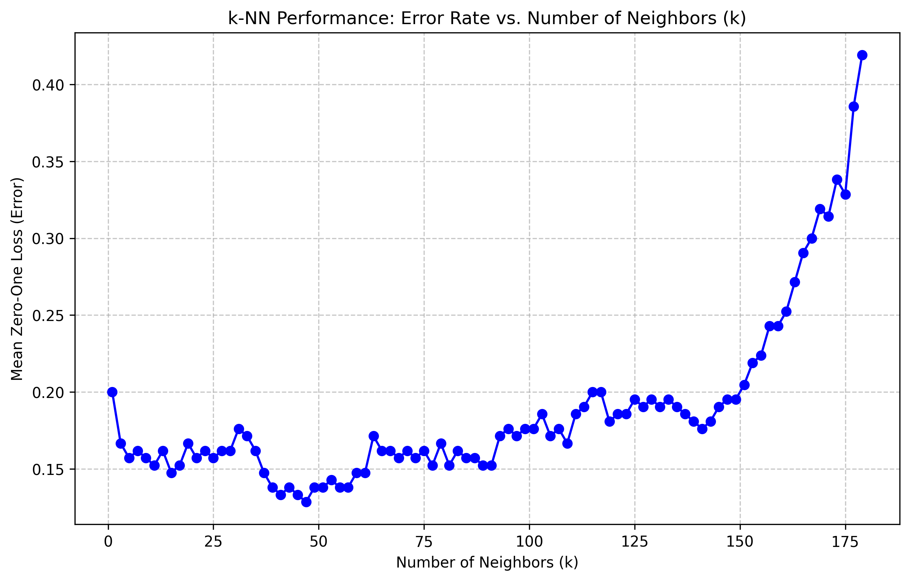

# k-Nearest Neighbors (k-NN) Performance Analysis

This project explores the behavior of the k-NN algorithm, focusing on hyperparameter tuning and the impact of feature noise on model performance.

## 🚀 Key Implementations
- **Manual k-NN Pipeline:** Implementing a training and evaluation workflow using `scikit-learn`.
- **Cross-Validation:** Utilizing 10-fold CV to ensure robust error estimation.
- **Complexity Analysis:** Visualizing the bias-variance tradeoff by observing how changing `k` impacts the Mean Zero-One Loss.

## 📊 Findings
- **Optimal k:** By inspecting the error plot, we can identify the value of $k$ that minimizes loss before underfitting occurs.
- **Robustness to Noise:** The project includes experiments on label flipping and adding random dimensions to test the "Curse of Dimensionality."

## Visualization Output


## How to use
Run the analysis script:
```bash
python knn_classification.py
